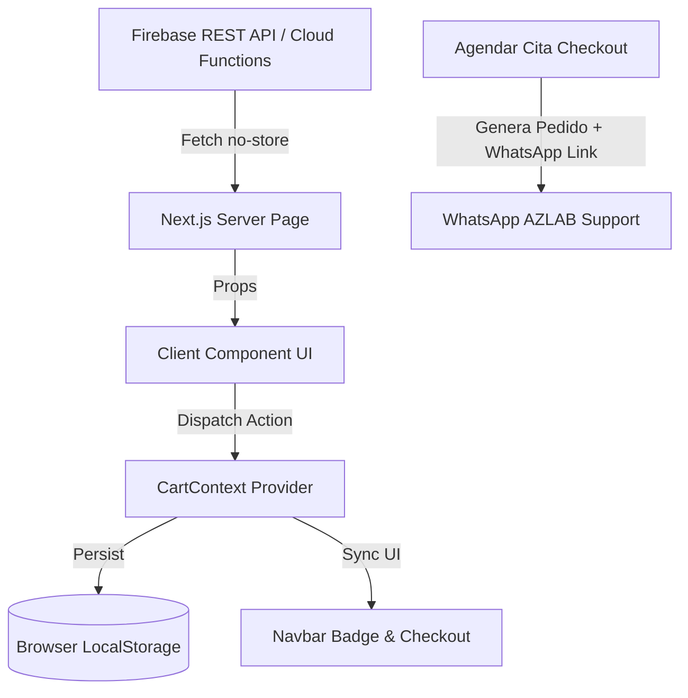

# 📚 Documentación Técnica Integral - AZLAB Website

Bienvenido a la documentación oficial del proyecto frontend **AZLAB Healthcare**. Este documento está diseñado para que cualquier desarrollador (nuevo o experimentado) comprenda la arquitectura, el flujo de datos, las tecnologías, las reglas de negocio y los pasos necesarios para mantener o extender la aplicación.

---

## 📑 Tabla de Contenidos

1. [Visión General del Proyecto](#-visión-general-del-proyecto)
2. [Stack Tecnológico y Dependencias](#-stack-tecnológico-y-dependencias)
3. [Estructura del Proyecto](#-estructura-del-proyecto)
4. [Arquitectura y Principios de Diseño](#-arquitectura-y-principios-de-diseño)
5. [Rutas y Módulos de la Aplicación](#-rutas-y-módulos-de-la-aplicación)
6. [Gestión de Estado Global (Carrito)](#-gestión-de-estado-global-carrito)
7. [Lógica de Cobertura, Zonas y Tarifas de Entrega](#-lógica-de-cobertura-zonas-y-tarifas-de-entrega)
8. [Integración con Backend y API REST](#-integración-con-backend-y-api-rest)
9. [Flujo de Compra y Agendamiento (Checkout WhatsApp)](#-flujo-de-compra-y-agendamiento-checkout-whatsapp)
10. [Sistema de Diseño y Estilos (Tailwind CSS v4)](#-sistema-de-diseño-y-estilos-tailwind-css-v4)
11. [Guía de Configuración y Desarrollo Local](#-guía-de-configuración-y-desarrollo-local)
12. [Guía para Desarrolladores: Cómo Extender el Proyecto](#-guía-para-desarrolladores-cómo-extender-el-proyecto)
13. [Despliegue a Producción](#-despliegue-a-producción)

---

## 🏥 Visión General del Proyecto

**AZLAB Healthcare** es una plataforma web orientada al sector salud en El Salvador (principalmente la zona occidental: Santa Ana, Ahuachapán, Sonsonate y municipios aledaños).

### Objetivos principales:
*   **Catálogo Digital de Exámenes:** Permitir a los pacientes explorar, buscar y filtrar más de 39 tipos de exámenes clínicos categorizados.
*   **Servicio a Domicilio:** Facilitar la cotización y agendamiento de toma de muestras clínicas directamente en la casa u oficina del paciente.
*   **Calculadora de Tarifas Dinámica:** Calcular costos de traslado en tiempo real según la jurisdicción y el monto del pedido (con soporte de promociones como *Envío Gratis desde $35.00*).
*   **Conversión Rápida vía WhatsApp:** Generar órdenes con códigos únicos (`AZ-XXXXX`) y estructurar los pedidos para enviarlos en un clic al equipo de atención al cliente por WhatsApp.

---

## 🛠️ Stack Tecnológico y Dependencias

| Tecnología | Versión | Propósito |
| :--- | :--- | :--- |
| **Next.js** | `16.1.6` (App Router) | Framework React con Server Components, optimización de fuentes y rutas modernas. |
| **React** | `19.2.3` | Biblioteca base de componentes de interfaz de usuario. |
| **TypeScript** | `^5.0` | Tipado estático y seguridad en tiempo de compilación. |
| **Tailwind CSS** | `^4.0` (con `@tailwindcss/postcss`) | Sistema de diseño utilitario de última generación. |
| **Material Symbols Outlined** | Google Fonts CDN | Iconografía médica y de navegación. |
| **Gomarice Rockin Record** | Fuente Local `.ttf` | Tipografía personalizada para el isotipo de la marca AZLab. |
| **Inter** | Google Fonts (`next/font/google`) | Tipografía sans-serif principal del cuerpo y encabezados. |
| **pnpm** | `>= 8.0` | Gestor de paquetes eficiente recomendado. |

---

## 📂 Estructura del Proyecto

```text
azlab-website/
├── public/                     # Recursos estáticos públicos (imágenes, favicons, logos)
├── services/
│   ├── api.ts                  # Cliente de conexión con el Backend (Cloud Functions / Emuladores)
│   └── response-example.json   # Muestra tipada de respuesta del backend
├── src/
│   ├── app/                    # Next.js App Router (Rutas, Layouts y Páginas)
│   │   ├── a-domicilio/        # Página informativa del servicio a domicilio
│   │   │   └── page.tsx
│   │   ├── carrito/            # Módulo del carrito de compras
│   │   │   ├── agendar/        # Wizard de checkout de 2 pasos para agendamiento
│   │   │   │   └── page.tsx
│   │   │   └── page.tsx        # Resumen del carrito y edición de ítems
│   │   ├── cobertura/          # Directorio de jurisdicciones, distritos y tarifas
│   │   │   └── page.tsx
│   │   ├── contacto/           # Canales de atención y formulario de contacto
│   │   │   └── page.tsx
│   │   ├── examenes/           # Catálogo completo con buscador y filtros
│   │   │   ├── ExamenesClient.tsx # Componente cliente interactivo (modal, filtros, paginación)
│   │   │   └── page.tsx        # Server Component para Data Fetching inicial
│   │   ├── fonts/              # Fuentes locales (Gomarice Rockin Record)
│   │   │   └── gomarice_rockin_record.ttf
│   │   ├── politicas/          # Términos, privacidad, bioseguridad y consentimientos
│   │   │   └── page.tsx
│   │   ├── globals.css         # Configuración del tema Tailwind v4 y estilos base
│   │   ├── layout.tsx          # Root Layout global (Navbar, Footer, CartProvider, Fonts)
│   │   └── page.tsx            # Página de Inicio (Landing Page)
│   ├── components/             # Componentes modulares y reutilizables
│   │   ├── ContactCta.tsx      # Banner CTA de llamada a la acción
│   │   ├── ContactForm.tsx     # Formulario de contacto con envío a WhatsApp
│   │   ├── Faqs.tsx            # Sección de preguntas frecuentes
│   │   ├── Footer.tsx          # Pie de página con enlaces y datos legales
│   │   ├── Hero.tsx            # Hero principal de la página de inicio
│   │   ├── HowItWorks.tsx      # Pasos explicativos del servicio (1-2-3)
│   │   ├── ImageCarousel.tsx   # Galería fotográfica interactiva
│   │   ├── Navbar.tsx          # Barra de navegación con contador de carrito en vivo
│   │   ├── PopularExams.tsx    # Grid de exámenes destacados en el home
│   │   └── Reviews.tsx         # Testimonios de pacientes
│   ├── context/
│   │   └── CartContext.tsx     # Contexto global de React para el carrito con LocalStorage
│   ├── data/
│   │   └── locations.ts        # Matriz de distritos, jurisdicciones, tarifas y promociones
│   └── types/
│       └── product.ts          # Definición de interfaces TypeScript para productos
├── .env.local                  # Variables de entorno locales (ignoradas en git)
├── eslint.config.mjs           # Configuración de ESLint 9
├── next.config.ts              # Configuración de Next.js
├── package.json                # Definición de dependencias y scripts
├── postcss.config.mjs          # Configuración de PostCSS con Tailwind v4
└── tsconfig.json               # Configuración de TypeScript
```

---

## 🏛️ Arquitectura y Principios de Diseño

### 1. Server Components vs. Client Components (Patrón Híbrido)
*   **Server Components (`page.tsx` por defecto):**
    *   Manejan la carga inicial de datos desde la API (`cache: "no-store"` para evitar datos obsoletos).
    *   Mejoran el SEO, reducen el bundle enviado al navegador y facilitan el rendering rápido.
    *   Ejemplo: `/examenes/page.tsx` recibe `searchParams`, consulta la API y pasa los productos al cliente.
*   **Client Components (`"use client"`):**
    *   Se utilizan para interactividad: modales, estados locales, formularios, persistencia en `localStorage` y navegación dinámica.
    *   Ejemplo: `ExamenesClient.tsx`, `CartContext.tsx`, `ContactForm.tsx`, `/carrito/agendar/page.tsx`.

### 2. Flujo Unidireccional de Datos


---

## 🌐 Rutas y Módulos de la Aplicación

### 1. Inicio (`/`) — `src/app/page.tsx`
Landing page con estructura de alta conversión:
*   **Hero (`Hero.tsx`):** Mensaje principal, llamada a la acción para agendar y verificar exámenes.
*   **Exámenes Populares (`PopularExams.tsx`):** Muestra los primeros 4 exámenes obtenidos desde la API.
*   **Cómo Funciona (`HowItWorks.tsx`):** 3 pasos simples (Cotiza -> Agenda -> Recibe resultados).
*   **Galería (`ImageCarousel.tsx`):** Muestra el equipo humano, equipos e instalaciones.
*   **Reseñas (`Reviews.tsx`):** Calificaciones y testimonios de pacientes.
*   **Preguntas Frecuentes (`Faqs.tsx`):** Acordeón interactivo con respuestas sobre ayuno, entrega de resultados y servicio a domicilio.
*   **Contact CTA (`ContactCta.tsx`):** Banner inferior de contacto rápido.

### 2. A Domicilio (`/a-domicilio`) — `src/app/a-domicilio/page.tsx`
Página dedicada a detallar el servicio de toma de muestras a domicilio:
*   Ventajas clave: amplia cobertura, horarios flexibles (desde 6:00 AM para ayuno) y métodos de pago (efectivo, transferencia o tarjeta).
*   Llamado directo a la página de `/cobertura`.

### 3. Cobertura (`/cobertura`) — `src/app/cobertura/page.tsx`
Directorio exhaustivo de zonas de cobertura:
*   Muestra las 5 jurisdicciones principales.
*   Presenta tarjetas por cada uno de los 21 distritos con su **tiempo estimado de traslado** y **tarifa de servicio**.
*   Indica visualmente las promociones activas (badge de *Servicio GRATIS en compras mayores a $35.00* para Santa Ana Centro).

### 4. Catálogo de Exámenes (`/examenes`) — `src/app/examenes/`
*   **`page.tsx` (Server):** Lee `searchParams` (`page`, `category`, `cursor`, `search`), llama a `getProducts()` y calcula la paginación.
*   **`ExamenesClient.tsx` (Client):**
    *   **Buscador en tiempo real:** Filtra por nombre o código del examen.
    *   **15 Categorías médicas:** Pestañas con iconos temáticos (Química Sanguínea, Hematología, Ureanálisis, Hormonas, Perfiles/Paquetes, etc.).
    *   **Paginación:** Navegación por páginas o cursores.
    *   **Modal de Detalle (`ProductModal`):** Muestra descripción completa, precio, código interno y selector de cantidad (1 a 5 unidades) con botón "Agregar al Carrito".

### 5. Carrito de Compras (`/carrito`) — `src/app/carrito/page.tsx`
*   Lista todos los exámenes añadidos con su icono, nombre, categoría y precio.
*   Permite incrementar, disminuir (máx. 5 por examen) o eliminar ítems.
*   Calcula el subtotal acumulado.
*   Si está vacío, muestra un estado amigable con botón para ir al catálogo.
*   Botón directo para avanzar al Wizard de Agendamiento.

### 6. Agendamiento de Citas / Checkout (`/carrito/agendar`) — `src/app/carrito/agendar/page.tsx`
Wizard de 2 pasos para concretar la cita:
*   **Paso 1 (Datos de Ubicación y Contacto):**
    *   Nombre completo del paciente.
    *   Número de teléfono (mínimo 8 dígitos).
    *   Selector de Municipio/Distrito (con búsqueda y agrupación por jurisdicción).
    *   Dirección exacta (calle, número de casa, colonia, punto de referencia).
    *   Instrucciones o notas adicionales.
*   **Paso 2 (Confirmación y Resumen del Pedido):**
    *   Resumen detallado de los exámenes solicitados.
    *   Cálculo en vivo de la tarifa de envío según el distrito seleccionado.
    *   Indicador de "Faltan $X.XX para envío gratis" si aplica al distrito.
    *   Generación automática de un **Código de Pedido Único** (ej: `AZ-84920K`).
    *   Botón para copiar el código de pedido al portapapeles.
    *   Botón **"Confirmar y Enviar por WhatsApp"**: Abre WhatsApp Web / App con un mensaje perfectamente formateado con los datos del paciente, dirección, lista de exámenes, código de orden y total a pagar.

### 7. Contacto (`/contacto`) — `src/app/contacto/page.tsx`
*   Información general: Teléfono (`+503 6956-5468`), Correo (`info@azlabhealthcare.com`), Dirección física y Horario (`Lun - Sáb: 6:00 AM - 4:00 PM`).
*   Formulario interactivo (`ContactForm.tsx`) con validación de campos que envía la consulta directamente por WhatsApp.

### 8. Políticas y Privacidad (`/politicas`) — `src/app/politicas/page.tsx`
Página interactiva con navegación por pestañas y acordeón para normativas legales y médicas:
1.  *Términos y Condiciones de Uso*
2.  *Política de Privacidad y Tratamiento de Datos Personales*
3.  *Consentimiento Informado para Toma de Muestras*
4.  *Políticas de Cancelación, Reagendamiento y Reembolsos*
5.  *Protocolos de Bioseguridad y Calidad*

---

## 🛒 Gestión de Estado Global (Carrito)

El carrito se gestiona globalmente mediante **React Context** en `src/context/CartContext.tsx`.

### Tipos y Métodos disponibles vía `useCart()`:

```typescript
export interface CartItem {
  product: Product;
  quantity: number; // Límite máximo: 5 por producto
}

interface CartContextType {
  items: CartItem[];
  addToCart: (product: Product, quantity: number) => void;
  removeFromCart: (productId: string) => void;
  updateQuantity: (productId: string, quantity: number) => void;
  clearCart: () => void;
  totalItems: number; // Total acumulado de unidades
}
```

### Características de implementación:
*   **Persistencia:** Se sincroniza automáticamente con el `localStorage` del navegador bajo la clave `azlab_cart`.
*   **Seguridad SSR:** Inicialización segura que comprueba si `typeof window !== "undefined"` para evitar errores de hidratación.
*   **Límites de negocio:** Restringe la cantidad por examen entre 1 y 5 unidades para prevenir pedidos anómalos.

---

## 📍 Lógica de Cobertura, Zonas y Tarifas de Entrega

Toda la lógica de geolocalización y costos de traslado reside en `src/data/locations.ts`.

### Modelo de Datos:
```typescript
export interface DeliveryDistrict {
  id: string;             // Identificador único (ej: "sa-centro-el-palmar")
  jurisdiccion: string;   // Jurisdicción principal
  distrito: string;       // Nombre del distrito / colonia
  approxTimeMin: number;  // Tiempo estimado de traslado en minutos
  fee: number;            // Tarifa base en USD
  freeThreshold?: number; // Monto mínimo en exámenes para delivery gratis (ej: $35.00)
}
```

### Jurisdicciones Soportadas:
1.  **Santa Ana Centro:** 11 distritos (Centro, El Ivu, El Trébol, San Miguelito, El Palmar, El Colón, Jardines de Tecana, Lamatepec, Cutumay Camones, Santa Leonor, Zona Calle Vieja). Tarifa $2.00 a $3.00. **Envío gratis en compras $\ge$ $35.00**.
2.  **Santa Ana Norte:** 5 distritos (Santa Ana Norte, Masahuat, Metapán, Santa Rosa Guachipilín, Texistepeque). Tarifa $3.50 a $15.00.
3.  **Santa Ana Oeste:** 6 distritos (Candelaria de La Frontera, Chalchuapa, El Porvenir, San Antonio Pajonal, San Sebastián Salitrillo, Santiago de La Frontera). Tarifa $3.50 a $10.00.
4.  **Santa Ana Este:** 2 distritos (Coatepeque, El Congo). Tarifa $5.00 a $6.00.
5.  **Otros Departamentos de Occidente:** Ahuachapán Centro ($10.00), Sonsonate Centro ($15.00).

### Función de Cálculo (`calculateDeliveryFee`):
```typescript
const result = calculateDeliveryFee(selectedDistrict, subtotal);
// Retorna: { fee: number, isFree: boolean, baseFee: number, remainingForFree: number }
```

---

## 🔌 Integración con Backend y API REST

El archivo `services/api.ts` es el único punto de contacto con el servicio de datos.

### Variables de Configuración:
*   URL por defecto (Producción): `https://us-central1-azlab-9dae3.cloudfunctions.net/api`
*   Variable en `.env.local`: `NEXT_PUBLIC_API_URL`

### Funciones Principales:

#### 1. `getProducts(page, limit, category?, cursor?, search?)`
Consulta el catálogo de exámenes con soporte para filtros combinados:
*   **Cache:** `cache: "no-store"` para asegurar disponibilidad y precios actualizados en tiempo real.
*   **Búsqueda:** Añade parámetro `&search=` si se especifica un término.
*   **Categoría y Cursor:** Si se filtra por categoría, utiliza cursores (`&cursor=`) para la paginación eficiente de Firestore.
*   **Respuesta:** Retorna `{ ok: boolean, data: Product[], pagination: { hasMore, nextCursor, ... } }`.

#### 2. `getProductById(id: string)`
Obtiene un producto puntual por su código identificador (ej: `"AZ01"`).

### Estructura de un Producto (`Product`):
```typescript
export interface Product {
  id: string;          // Mismo que el código (ej: "AZ01")
  code: string;        // Código interno
  name: string;        // Nombre del examen médico
  category: string;    // Categoría oficial
  description: string; // Explicación médica y preparación requerida
  price: number;       // Precio en USD
  currency: string;    // "USD"
  active: boolean;     // Estado de disponibilidad
}
```

---

## 📲 Flujo de Compra y Agendamiento (Checkout WhatsApp)

En lugar de requerir una pasarela de pago obligatoria que añada fricción al paciente, AZLab utiliza un sistema híbrido de agendamiento rápido con confirmación directa:

```text
[Selección en Catálogo] 
        ⬇️
[Revisión en Carrito] 
        ⬇️
[Paso 1: Datos de Contacto + Distrito] 
        ⬇️
[Paso 2: Cálculo de Envío + Generación de Código AZ-XXXXX] 
        ⬇️
[Redirección con Mensaje Estructurado a WhatsApp (+503 6956-5468)] 
        ⬇️
[Atención y Confirmación con el Personal Clínico]
```

### Ejemplo de Mensaje Generado Automáticamente:
```text
*SOLICITUD DE CITA / PEDIDO - AZ LAB*
*Código de Pedido:* AZ-58291M

*Datos del Paciente:*
• *Nombre:* Juan Pérez
• *Teléfono:* 7890-1234
• *Municipio/Distrito:* Santa Ana Centro
• *Dirección:* Col. El Palmar, Pje. 4, Casa #12
• *Indicaciones:* Portón negro, tocar timbre

*Exámenes Solicitados:*
• 1x Hemograma Completo - $12.00
• 1x Perfil Lipídico - $18.00

*Resumen de Pago:*
• Subtotal: $30.00
• Servicio a Domicilio: $2.00
• *TOTAL ESTIMADO:* $32.00
```

---

## 🎨 Sistema de Diseño y Estilos (Tailwind CSS v4)

El proyecto utiliza **Tailwind CSS versión 4**. Los tokens de la marca están declarados en `src/app/globals.css` mediante la directiva `@theme`:

### 1. Paleta de Colores de la Marca:
*   **AzLab Blue (`--color-azlab-blue-*`):**
    *   Base: `#202b52` (`azlab-blue-500`)
    *   Escala: `50` (`#eef0f6`) hasta `900` (`#070a16`)
    *   Uso: Encabezados, textos oscuros, fondos institucionales y botones secundarios.
*   **AzLab Green (`--color-azlab-green-*`):**
    *   Base: `#2AA737` (`azlab-green-500`)
    *   Escala: `50` (`#edf9ef`) hasta `900` (`#09220b`)
    *   Uso: Botones principales (CTAs), badges de éxito, promociones y acentos de marca.

### 2. Tipografías:
*   **Sans General:** `Inter` (cargada con `next/font/google`).
*   **Logo Font:** `font-rockin` (definida como utility apuntando a `gomarice_rockin_record.ttf`).

### 3. Iconos (Material Symbols Outlined):
Para insertar iconos en cualquier componente:
```tsx
<span className="material-symbols-outlined text-azlab-green-500 text-xl">
  biotech
</span>
```

---

## 💻 Guía de Configuración y Desarrollo Local

### 1. Prerrequisitos
*   **Node.js:** Versión 20 o superior.
*   **pnpm:** Recomendado (`npm install -g pnpm`).
*   **Java JDK (Opcional):** Versión 11+ si deseas correr los emuladores locales de Firestore.

### 2. Instalación de Dependencias
```bash
git clone <URL_DEL_REPOSITORIO>
cd azlab-website
pnpm install
```

### 3. Configuración de Variables de Entorno
Crea un archivo `.env.local` en la raíz del proyecto:

```env
# Para desarrollo contra la API de producción en la nube:
NEXT_PUBLIC_API_URL=https://us-central1-azlab-9dae3.cloudfunctions.net/api

# O para desarrollo con los Emuladores de Firebase locales:
# NEXT_PUBLIC_API_URL=http://127.0.0.1:5001/azlab-9dae3/us-central1/api
```

### 4. Ejecución del Servidor de Desarrollo
```bash
pnpm dev
```
Abre tu navegador en [http://localhost:3000](http://localhost:3000).

### 5. Scripts Disponibles en `package.json`

| Comando | Descripción |
| :--- | :--- |
| `pnpm dev` | Inicia el servidor de desarrollo en modo hot-reload (`localhost:3000`). |
| `pnpm build` | Compila la aplicación y optimiza el bundle para producción. |
| `pnpm start` | Inicia el servidor en modo producción a partir del build generado. |
| `pnpm lint` | Ejecuta ESLint 9 para validar sintaxis y buenas prácticas. |

---

## 🚀 Guía para Desarrolladores: Cómo Extender el Proyecto

### 1. ¿Cómo agregar una nueva zona o distrito de cobertura?
1. Abre `src/data/locations.ts`.
2. Si es una nueva jurisdicción, agrégala al array `JURISDICCIONES`.
3. Añade el nuevo objeto al array `DELIVERY_LOCATIONS`:
   ```typescript
   {
     id: "sa-oeste-nuevo-distrito",
     jurisdiccion: "Santa Ana Oeste",
     distrito: "Nuevo Distrito",
     approxTimeMin: 20,
     fee: 4.0,
     freeThreshold: 35.0, // Opcional
   }
   ```
4. Automáticamente la página `/cobertura` y el selector de `/carrito/agendar` reflejarán el nuevo distrito y sus cálculos.

### 2. ¿Cómo agregar o modificar una categoría de exámenes?
1. Abre `src/app/examenes/ExamenesClient.tsx`.
2. Añade la categoría en el array `ALL_CATEGORIES`.
3. Asigna un icono de Material Symbols en la función `handleCategoryIcon(category)`.

### 3. ¿Cómo crear un nuevo componente visual?
1. Crea tu archivo en `src/components/MiComponente.tsx`.
2. Aplica las clases de Tailwind utilizando los colores semánticos (`azlab-blue-*` y `azlab-green-*`).
3. Importa y utiliza el componente en la página correspondiente.

---

## 🚢 Despliegue a Producción

El proyecto está 100% preparado para ser desplegado en plataformas como **Vercel**, **Netlify** o **Cloudflare Pages**:

1. Conecta el repositorio de GitHub con tu plataforma de hosting (Vercel recomendado para Next.js).
2. Configura la variable de entorno en el panel de control:
   *   `NEXT_PUBLIC_API_URL`: `https://us-central1-azlab-9dae3.cloudfunctions.net/api`
3. Comando de Build: `pnpm build` (o `next build`).
4. Directorio de salida: `.next`.

---

## 📞 Canales y Soporte Técnico

*   **Entorno de Pruebas / Backend Repositorio:** `azalab-backend-firebase`
*   **Teléfono / WhatsApp de Soporte:** `+503 6956-5468`
*   **Correo Electrónico:** `info@azlabhealthcare.com`
*   **Ubicación Principal:** 8va Avenida Sur, Entre 23 y 25 Calle Poniente, #2, Santa Ana, El Salvador.

---

*Documentación generada y mantenida para el equipo de desarrollo de AZLAB Healthcare.*
